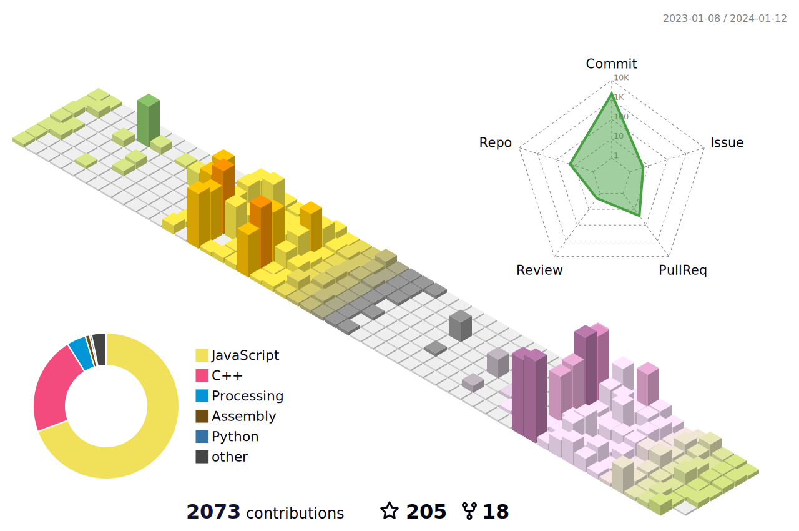

                                    

    
   

 

# My Libraries
|Library|Langage|Stars|Description|Other Links|
|-|-|-|-|-|
|[ziko.js](https://github.com/zakarialaoui10/ziko.js#readme)|`Javascript`||-|
|[dir2tree](https://github.com/zakarialaoui10/dir2tree#readme)|`Javascript`||dir2tree|[NPM](https://www.npmjs.com/package/dir2tree)
|[fetch-doc](https://github.com/zakarialaoui10/fetch-doc#readme)|`Javascript`||Fetch and parse HTML documents asynchronously and synchronously|[NPM](https://www.npmjs.com/package/fetch-doc)|
|[ZikoMatrix](https://github.com/zakarialaoui10/ZikoMatrix#readme)|`c++`||Arduino library for creating and manipulating matrices of arbitrary size and data type.|[Arduino](https://reference.arduino.cc/reference/en/libraries/zikomatrix/)|
|[PowerMonitor](https://github.com/zakarialaoui10/PowerMonitor#readme)|`c++`||Designed to measure the electrical characteristics of AC circuits such as voltage, current, power, reactive power, and power factor...|[Arduino](https://reference.arduino.cc/reference/en/libraries/powermonitor/)|
|[mapfun](https://github.com/zakarialaoui10/mapfun/)|`Javascript` `Python`||mapfun is a function that applies a mapping function to an infinite number of input elements, with options to skip certain elements and selectively apply the mapping to keys and/or values of objects.|[NPM](https://www.npmjs.com/package/mapfun) [PyPI](https://pypi.org/project/mapfun/)|

### ℂ𝕠𝕟𝕥𝕣𝕚𝕓𝕦𝕥𝕚𝕠𝕟𝕤: 

# Stats
## NPM 
  
## Github

        

 
<!--

### ⚔️ ℂ𝕠𝕕𝕖𝕎𝕒𝕣𝕤:  
 
        

             

 

 -->

